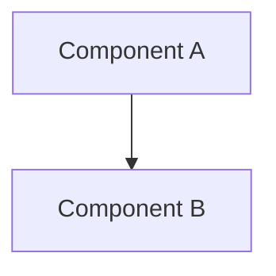

# Documentation Generator MCP - Design Decisions

## Decision Log

### DD-001: Stateless vs Stateful Design

**Decision:** Stateless MCP server
**Date:** 2025-10-31
**Status:** ✅ Approved

**Context:**
Documentation generation could cache parsed TypeScript ASTs or track generation history for performance optimization.

**Options:**
1. **Stateless** - Parse files on every request, no persistent state
2. **Stateful** - Cache ASTs, track generation history in memory
3. **Hybrid** - Use workspace-brain MCP for state storage

**Decision:** Stateless (#1)

**Rationale:**
- Simpler implementation and testing
- No cache invalidation complexity
- TypeScript parsing is fast enough (<1s for typical files)
- Aligns with 16/19 existing stateless MCPs
- workspace-brain MCP available if state needed later

**Trade-offs:**
- ✅ Simplicity, reliability
- ✅ No cache invalidation bugs
- ❌ Slightly slower repeated operations
- ❌ Can't track generation history without external storage

---

### DD-002: TypeScript Parser Choice

**Decision:** Use TypeScript Compiler API
**Date:** 2025-10-31
**Status:** ✅ Approved

**Context:**
Need to parse TypeScript files and extract JSDoc comments with type information.

**Options:**
1. **TypeScript Compiler API** - Official TypeScript parser
2. **@typescript-eslint/parser** - ESLint's TypeScript parser
3. **ts-morph** - Higher-level wrapper around TS compiler
4. **Regex-based** - Simple pattern matching

**Decision:** TypeScript Compiler API (#1)

**Rationale:**
- Official, battle-tested parser
- Complete type information access
- JSDoc extraction built-in
- No additional dependencies (TypeScript already required)
- Full AST access for diagram generation

**Trade-offs:**
- ✅ Accurate parsing, complete type info
- ✅ JSDoc extraction reliable
- ✅ Handles all TypeScript features
- ❌ Lower-level API (more code)
- ❌ Steeper learning curve vs ts-morph

**Alternative Considered:** ts-morph would be simpler but adds 5MB dependency for marginal benefit.

---

### DD-003: Changelog Format

**Decision:** Support Keep a Changelog + Simple formats
**Date:** 2025-10-31
**Status:** ✅ Approved

**Context:**
Different projects prefer different changelog formats.

**Options:**
1. **Keep a Changelog only** - Industry standard format
2. **Simple format only** - Minimal markdown list
3. **Both** - Support multiple formats via parameter

**Decision:** Both (#3)

**Rationale:**
- Keep a Changelog is industry standard (guiding humans, choosealicense.com)
- Some projects prefer simple commit lists
- Easy to support both with shared parsing logic
- Adds flexibility without complexity

**Implementation:**
```typescript
format: 'keepachangelog' | 'simple'
```

Keep a Changelog format:
```markdown
## [1.2.0] - 2025-10-31
### Added
- New feature X
### Fixed
- Bug Y
```

Simple format:
```markdown
# v1.2.0 (2025-10-31)
- feat: New feature X
- fix: Bug Y
```

---

### DD-004: Doc Coverage Prioritization

**Decision:** Prioritize public API > exported > private
**Date:** 2025-10-31
**Status:** ✅ Approved

**Context:**
Not all undocumented code is equally important. Public APIs need docs more than internal utilities.

**Priority Levels:**
1. **High** - Exported public functions/classes/interfaces
2. **Medium** - Exported but marked @internal
3. **Low** - Non-exported (private) code

**Rationale:**
- Public API documentation most valuable for users
- Internal code documentation nice-to-have
- Prioritization helps focus documentation efforts
- Aligns with semantic versioning (public API stability)

**Implementation:**
```typescript
gaps: Array<{
  symbol: string;
  priority: 'high' | 'medium' | 'low';
}>
```

---

### DD-005: Diagram Technology Choice

**Decision:** Mermaid.js (not PlantUML, Graphviz, or draw.io)
**Date:** 2025-10-31
**Status:** ✅ Approved

**Context:**
Need diagram format that renders in GitHub markdown and supports architecture/dependency/dataflow diagrams.

**Options:**
1. **Mermaid.js** - GitHub-native, markdown-based
2. **PlantUML** - Powerful but requires Java runtime
3. **Graphviz DOT** - Flexible but complex syntax
4. **draw.io XML** - Visual but not markdown-compatible

**Decision:** Mermaid.js (#1)

**Rationale:**
- Native GitHub rendering (no external tools needed)
- Markdown-based (easy to version control)
- Supports all needed diagram types
- Simple syntax
- No runtime dependencies

**Trade-offs:**
- ✅ GitHub-native rendering
- ✅ No external dependencies
- ✅ Simple syntax
- ❌ Less powerful than PlantUML
- ❌ Limited layout control

**Example:**


---

### DD-006: Documentation Update Strategy

**Decision:** Conservative auto-regeneration with manual review flags
**Date:** 2025-10-31
**Status:** ✅ Approved

**Context:**
When code changes, should docs auto-regenerate or require manual review?

**Strategy:**
- **Auto-regenerate:** JSDoc changes only (safe, content-preserving)
- **Flag for review:** Signature changes, breaking changes
- **Skip:** Non-code changes (comments, whitespace)

**Rationale:**
- JSDoc updates are safe (just content changes)
- Signature changes may need human explanation
- Breaking changes definitely need human review
- Prevents accidental doc degradation

**Implementation:**
```typescript
action: 'regenerate' | 'flag_review' | 'skip'
```

**Examples:**
- JSDoc content edited → `regenerate`
- Function signature changed → `flag_review`
- Whitespace changes → `skip`
- Breaking change committed → `flag_review`

---

### DD-007: Git Integration Method

**Decision:** Use simple-git library (not child_process git commands)
**Date:** 2025-10-31
**Status:** ✅ Approved

**Context:**
Need to read git commit history and detect file changes.

**Options:**
1. **simple-git** - Node.js git library
2. **child_process** - Execute git commands directly
3. **isomorphic-git** - Pure JavaScript git implementation

**Decision:** simple-git (#1)

**Rationale:**
- Well-maintained, popular library (6M+ weekly downloads)
- Clean promise-based API
- Handles git errors gracefully
- Cross-platform (Windows, Mac, Linux)
- Lightweight (vs isomorphic-git)

**Trade-offs:**
- ✅ Clean API, error handling
- ✅ Cross-platform
- ✅ Popular, maintained
- ❌ Requires git installed (acceptable - workspace requirement)

---

### DD-008: Output File Locations

**Decision:** Colocate generated docs with source code
**Date:** 2025-10-31
**Status:** ✅ Approved

**Context:**
Where should generated documentation files be written?

**Strategy:**
- **API docs:** `{sourceFile}.API.md` (next to source file)
- **Changelogs:** `CHANGELOG.md` (project root)
- **Diagrams:** `diagrams/{type}.md` (project root)
- **Catalog:** `DOCS-INDEX.md` (project root)

**Rationale:**
- API docs near source = easy to find, update, review
- Changelogs at root = convention
- Diagrams centralized = easier navigation
- Catalog at root = project overview

**Override:** All tools accept optional `outputFile` parameter for custom locations.

---

### DD-009: Metadata Extraction Method

**Decision:** Use gray-matter for YAML frontmatter parsing
**Date:** 2025-10-31
**Status:** ✅ Approved

**Context:**
Need to extract YAML frontmatter from markdown files for catalog generation.

**Options:**
1. **gray-matter** - Dedicated frontmatter parser
2. **js-yaml** - Generic YAML parser (manual extraction)
3. **Regex** - Simple pattern matching

**Decision:** gray-matter (#1)

**Rationale:**
- Purpose-built for markdown frontmatter
- Handles edge cases (missing frontmatter, malformed YAML)
- Popular, well-tested (2M+ weekly downloads)
- Returns both frontmatter and content separately

**Example:**
```typescript
import matter from 'gray-matter';
const { data, content } = matter(markdownFile);
// data = { type: 'guide', tags: ['example'] }
// content = markdown without frontmatter
```

---

### DD-010: Test Strategy

**Decision:** Unit tests + Integration tests (no E2E)
**Date:** 2025-10-31
**Status:** ✅ Approved

**Testing Pyramid:**
- **Unit tests (70%)** - Test each tool in isolation, mock file system and git
- **Integration tests (30%)** - Test with real TypeScript files and git repos
- **No E2E tests** - MCP server behavior tested via unit/integration

**Rationale:**
- Unit tests fast, reliable, good coverage
- Integration tests catch real-world issues
- E2E not needed (MCP SDK handles transport)
- Aligns with other MCP testing strategies

**Coverage Target:** >70% overall

---

## Future Considerations

### FC-001: Multi-language Support
**Status:** Deferred to Phase 2

Could extend to JavaScript, Python, Go documentation generation.
**Complexity:** High (different parsers for each language)
**Value:** Medium (TypeScript covers 90% of workspace needs)

### FC-002: AI-Powered Doc Improvement
**Status:** Deferred to Phase 2

Use LLM to suggest documentation improvements, fill gaps, improve clarity.
**Complexity:** Medium (requires LLM integration)
**Value:** High (automates doc quality improvement)

### FC-003: Doc Quality Scoring
**Status:** Deferred to Phase 2

Score documentation quality (completeness, clarity, examples, links).
**Complexity:** Medium (heuristic-based scoring)
**Value:** Medium (helps prioritize improvements)

---

**Last Updated:** 2025-10-31
**Next Review:** After Phase 1 implementation complete
