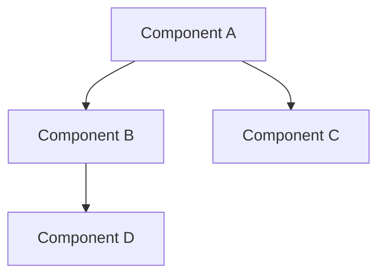
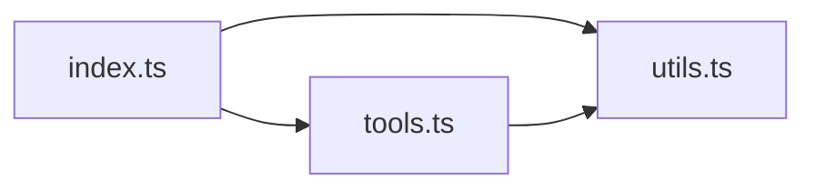
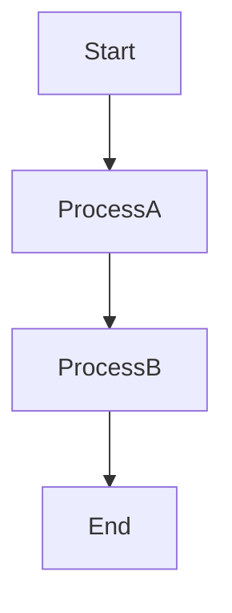

# Documentation Generator MCP - Technical Specification

**Version:** 1.0.0
**MCP SDK Version:** ^1.0.4
**TypeScript Version:** ^5.3.3

## Overview

Stateless MCP server providing 6 documentation automation tools with TypeScript/JSDoc parsing, git integration, and markdown generation capabilities.

## Tools

### 1. generate_api_docs

Generate API documentation from TypeScript source files with JSDoc comments.

**Input Schema:**
```typescript
{
  sourceFile: string;           // Absolute path to TypeScript file
  outputFile?: string;          // Optional output path (default: sourceFile.API.md)
  includePrivate?: boolean;     // Include private members (default: false)
  includeExamples?: boolean;    // Extract examples from tests (default: true)
  format?: 'markdown' | 'html'; // Output format (default: markdown)
}
```

**Output:**
```typescript
{
  success: boolean;
  outputPath: string;           // Where docs were written
  stats: {
    functionsDocumented: number;
    classesDocumented: number;
    interfacesDocumented: number;
    typesDocumented: number;
    totalSymbols: number;
  };
  warnings?: string[];          // Missing docs, parse errors
}
```

**Implementation:**
- Use TypeScript Compiler API for AST parsing
- Extract JSDoc comments via ts.getJSDocCommentsAndTags()
- Parse type information from AST nodes
- Generate markdown with proper formatting
- Extract code examples from adjacent test files

### 2. generate_changelog

Generate changelog from git commit history with automatic categorization.

**Input Schema:**
```typescript
{
  projectPath: string;          // Absolute path to git repository
  fromVersion?: string;         // Start tag/commit (default: last tag)
  toVersion?: string;           // End tag/commit (default: HEAD)
  outputFile?: string;          // Output path (default: projectPath/CHANGELOG.md)
  format?: 'keepachangelog' | 'simple'; // Changelog format
  groupBy?: 'type' | 'scope';   // How to group commits
}
```

**Output:**
```typescript
{
  success: boolean;
  outputPath: string;
  stats: {
    totalCommits: number;
    features: number;
    fixes: number;
    breakingChanges: number;
    chores: number;
    others: number;
  };
  changelog: string;            // Generated changelog content
}
```

**Implementation:**
- Use simple-git for commit history
- Parse conventional commit format (feat:, fix:, BREAKING:)
- Categorize commits by type/scope
- Generate markdown with version headers
- Support semantic versioning

### 3. track_doc_coverage

Scan TypeScript files and calculate documentation coverage percentage.

**Input Schema:**
```typescript
{
  projectPath: string;          // Project root to scan
  includePatterns?: string[];   // Glob patterns to include (default: ["**/*.ts"])
  excludePatterns?: string[];   // Patterns to exclude (default: ["**/*.test.ts", "**/node_modules/**"])
  minCoverage?: number;         // Minimum coverage threshold (default: 70)
  reportFormat?: 'summary' | 'detailed' | 'json';
}
```

**Output:**
```typescript
{
  success: boolean;
  coverage: {
    percentage: number;         // Overall coverage percentage
    documented: number;         // Number of documented symbols
    undocumented: number;       // Number of undocumented symbols
    total: number;              // Total symbols
  };
  byType: {
    functions: { documented: number; total: number; percentage: number; };
    classes: { documented: number; total: number; percentage: number; };
    interfaces: { documented: number; total: number; percentage: number; };
    types: { documented: number; total: number; percentage: number; };
  };
  gaps: Array<{
    file: string;
    symbol: string;
    type: 'function' | 'class' | 'interface' | 'type';
    line: number;
    priority: 'high' | 'medium' | 'low'; // Based on public/private
  }>;
  passesThreshold: boolean;
}
```

**Implementation:**
- Parse all TypeScript files in project
- Extract exported symbols
- Check for JSDoc comments
- Calculate coverage by type
- Prioritize public API documentation

### 4. generate_diagrams

Generate Mermaid.js diagrams from code structure analysis.

**Input Schema:**
```typescript
{
  projectPath: string;          // Project root
  diagramType: 'architecture' | 'dependencies' | 'dataflow';
  sourceFiles?: string[];       // Specific files to analyze (default: all)
  outputFile?: string;          // Output path (default: projectPath/diagrams/{type}.md)
  maxDepth?: number;            // Max depth for dependency traversal (default: 3)
}
```

**Output:**
```typescript
{
  success: boolean;
  outputPath: string;
  diagram: string;              // Mermaid.js syntax
  stats: {
    nodesCount: number;         // Components/functions analyzed
    edgesCount: number;         // Relationships found
    depth: number;              // Actual depth traversed
  };
}
```

**Diagram Types:**

**Architecture:** Component relationships


**Dependencies:** Import graph


**Data Flow:** Function call chains


**Implementation:**
- Parse imports with TypeScript compiler
- Build dependency graph
- Analyze function calls for data flow
- Generate Mermaid.js syntax
- Write markdown file with diagram

### 5. update_documentation

Detect code changes and regenerate affected documentation.

**Input Schema:**
```typescript
{
  projectPath: string;          // Project root
  since?: string;               // Git ref to compare (default: last commit)
  dryRun?: boolean;             // Preview changes without writing (default: false)
  autoCommit?: boolean;         // Auto-commit doc updates (default: false)
}
```

**Output:**
```typescript
{
  success: boolean;
  changes: Array<{
    sourceFile: string;         // Changed source file
    affectedDocs: string[];     // Docs that need regeneration
    action: 'regenerate' | 'flag_review' | 'skip';
    reason: string;
  }>;
  regenerated: string[];        // Docs that were regenerated
  flaggedForReview: string[];   // Docs needing manual review
  stats: {
    filesChanged: number;
    docsRegenerated: number;
    docsFlaggedForReview: number;
  };
}
```

**Implementation:**
- Use git diff to detect changed files
- Map source files to generated docs
- Determine if automatic regeneration is safe
- Regenerate docs or flag for manual review
- Update timestamps in frontmatter

### 6. catalog_documentation

Scan and index all markdown documentation files.

**Input Schema:**
```typescript
{
  projectPath: string;          // Project root to scan
  outputFile?: string;          // Index output path (default: projectPath/DOCS-INDEX.md)
  includePatterns?: string[];   // Patterns to include (default: ["**/*.md"])
  excludePatterns?: string[];   // Patterns to exclude (default: ["**/node_modules/**"])
  extractMetadata?: boolean;    // Extract YAML frontmatter (default: true)
}
```

**Output:**
```typescript
{
  success: boolean;
  outputPath: string;
  catalog: Array<{
    filePath: string;           // Relative path to doc
    title: string;              // Doc title
    type?: string;              // From frontmatter
    tags?: string[];            // From frontmatter
    lastModified: string;       // ISO timestamp
    wordCount: number;
    links: string[];            // Internal links found
  }>;
  stats: {
    totalDocs: number;
    byType: Record<string, number>;
    avgWordCount: number;
    brokenLinks: Array<{ file: string; link: string; }>;
  };
  navigation: string;           // Generated markdown navigation tree
}
```

**Implementation:**
- Scan for all markdown files
- Extract YAML frontmatter with gray-matter
- Parse markdown for title, links, word count
- Validate internal links
- Generate navigation tree
- Create searchable index

## Data Models

### DocumentationMetadata
```typescript
interface DocumentationMetadata {
  type: 'guide' | 'readme' | 'api' | 'specification' | 'reference';
  tags: string[];
  created: string;              // ISO date
  lastUpdated: string;          // ISO date
  version?: string;
  author?: string;
}
```

### SymbolDocumentation
```typescript
interface SymbolDocumentation {
  name: string;
  kind: 'function' | 'class' | 'interface' | 'type' | 'variable';
  signature: string;            // Full type signature
  description: string;          // JSDoc description
  params?: Array<{
    name: string;
    type: string;
    description: string;
    optional: boolean;
  }>;
  returns?: {
    type: string;
    description: string;
  };
  examples?: string[];          // Code examples
  tags?: string[];              // JSDoc tags (@deprecated, @internal)
  sourceFile: string;
  line: number;
}
```

### CommitEntry
```typescript
interface CommitEntry {
  hash: string;
  type: 'feat' | 'fix' | 'chore' | 'docs' | 'style' | 'refactor' | 'test' | 'breaking';
  scope?: string;
  subject: string;
  body?: string;
  author: string;
  date: string;
  breaking: boolean;
}
```

## Error Handling

**Common Error Codes:**
- `INVALID_PATH` - Source file/directory not found
- `PARSE_ERROR` - TypeScript parsing failed
- `GIT_ERROR` - Git operation failed
- `WRITE_ERROR` - Failed to write output file
- `VALIDATION_ERROR` - Generated output invalid

**Error Response Format:**
```typescript
{
  success: false;
  error: {
    code: string;
    message: string;
    details?: any;
  };
}
```

## Integration Requirements

### git-assistant MCP
- Access git commit history
- Detect file changes
- Extract commit metadata

### project-index-generator MCP
- Feed generated docs into project index
- Update doc catalog when new docs created

### workspace-brain MCP
- Log documentation generation events
- Track coverage metrics over time

## Performance Requirements

- API doc generation: <5 seconds for 500 LOC file
- Changelog generation: <3 seconds for 100 commits
- Coverage scan: <10 seconds for 10,000 LOC
- Diagram generation: <5 seconds per diagram
- Catalog scan: <5 seconds for 100 markdown files

## Testing Requirements

**Unit Tests (>70% coverage):**
- Each tool tested independently
- Mock file system operations
- Mock git operations
- Validate output format

**Integration Tests:**
- Test with real TypeScript files
- Test with real git repositories
- Validate generated markdown
- Test cross-MCP integration

**Validation Tests:**
- Generated docs render correctly
- Diagrams display in GitHub
- Links resolve correctly
- Frontmatter parses correctly

## Security Considerations

- Validate all file paths (prevent directory traversal)
- Sanitize markdown output (prevent XSS in HTML export)
- Don't expose sensitive data in generated docs
- Validate git repository access

## Dependencies

```json
{
  "dependencies": {
    "@modelcontextprotocol/sdk": "^1.0.4",
    "zod": "^3.22.4",
    "typescript": "^5.3.3",
    "simple-git": "^3.22.0",
    "gray-matter": "^4.0.3"
  },
  "devDependencies": {
    "@types/node": "^20.10.6",
    "@types/jest": "^29.5.11",
    "jest": "^29.7.0",
    "ts-jest": "^29.1.1"
  }
}
```

## Configuration

No configuration file needed - stateless design. All parameters passed via tool inputs.

---

**Status:** Complete Specification
**Last Updated:** 2025-10-31
**Next Step:** Implementation
