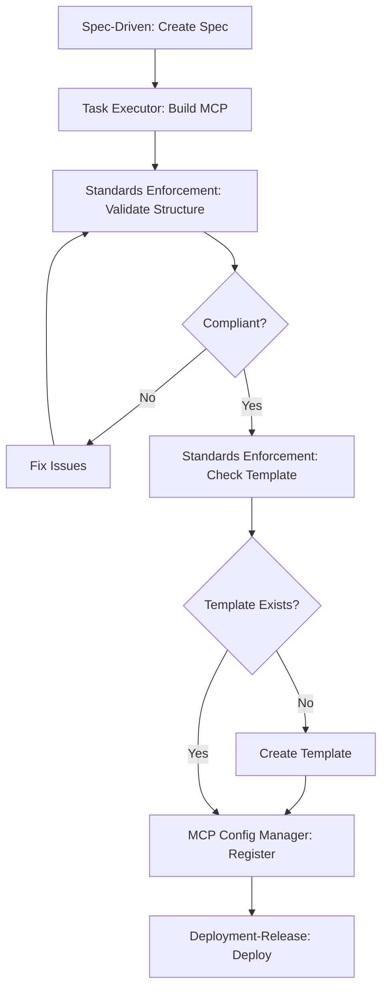

# Standards Enforcement MCP - Integration Strategy

## Executive Summary

This document outlines how the Standards Enforcement MCP integrates with existing workspace MCPs to provide automated standards validation throughout the development lifecycle.

## Integration Points

### 1. **Deployment-Release MCP** (Pre-Deployment Gate)

**When**: Before any deployment to production
**What**: Validate MCP compliance before release

```typescript
// Integration in deployment-release-mcp
async function deploy_application(params) {
  // Step 1: Run standards validation
  const validation = await standardsEnforcementMcp.validate_mcp_compliance({
    mcpName: params.target,
    failFast: true,
    includeWarnings: false, // Only critical issues block deployment
  });

  // Step 2: Check compliance
  if (!validation.compliant) {
    throw new Error(`Deployment blocked: ${validation.summary.criticalViolations} critical violations found`);
  }

  // Step 3: Proceed with deployment
  await performDeployment(params);
}
```

**Benefit**: No non-compliant code reaches production

---

### 2. **Task Executor MCP** (Workflow Completion Check)

**When**: After completing a development workflow
**What**: Validate project structure and compliance

```typescript
// Integration in task-executor-mcp
async function complete_workflow(workflowName, projectPath) {
  // Complete all tasks...

  // Before archiving, validate compliance
  const validation = await standardsEnforcementMcp.validate_project_structure({
    projectPath,
    expectedStructure: '8-folder',
    strictMode: false,
  });

  if (!validation.compliant) {
    console.warn(`⚠️  Compliance issues found. Run standards validation before deployment.`);
  }

  // Archive workflow
}
```

**Benefit**: Catch structural issues early in development

---

### 3. **MCP Config Manager** (Registration Validation)

**When**: When registering a new MCP
**What**: Ensure MCP meets standards before registration

```typescript
// Integration in mcp-config-manager
async function register_mcp_server(serverName, scope) {
  // Step 1: Validate MCP exists in both environments
  const validation = await standardsEnforcementMcp.validate_mcp_compliance({
    mcpName: serverName,
    categories: ['dual-environment', 'template-first'],
    failFast: true,
  });

  // Step 2: Check critical violations
  if (validation.summary.criticalViolations > 0) {
    throw new Error(`Cannot register MCP: ${validation.summary.criticalViolations} critical violations`);
  }

  // Step 3: Proceed with registration
  await registerInClaudeConfig(serverName, scope);
}
```

**Benefit**: Only compliant MCPs get registered

---

### 4. **Git Assistant MCP** (Pre-Commit Hook)

**When**: Before committing code
**What**: Validate security and documentation standards

```typescript
// Integration in git-assistant-mcp
async function check_commit_readiness(context) {
  // Check if committing MCP code
  const isMcpCode = context.includes('mcp-servers');

  if (isMcpCode) {
    // Run security validation
    const validation = await standardsEnforcementMcp.validate_mcp_compliance({
      mcpName: extractMcpName(context),
      categories: ['security', 'documentation'],
      includeWarnings: true,
    });

    // Warn about issues
    if (validation.violations.length > 0) {
      return {
        ready: validation.summary.criticalViolations === 0,
        warnings: validation.violations,
        message: `Found ${validation.summary.criticalViolations} critical, ${validation.summary.warningViolations} warnings`,
      };
    }
  }

  return { ready: true };
}
```

**Benefit**: Prevent committing code with hardcoded secrets or missing docs

---

### 5. **Workspace-Index MCP** (Periodic Audit)

**When**: During workspace indexing or on-demand
**What**: Full workspace compliance audit

```typescript
// Integration in workspace-index-mcp
async function validate_workspace_documentation(params) {
  const mcpServers = await listAllMcpServers();
  const results = [];

  // Validate each MCP
  for (const mcpName of mcpServers) {
    const validation = await standardsEnforcementMcp.validate_mcp_compliance({
      mcpName,
      includeWarnings: true,
    });

    results.push({
      mcpName,
      compliant: validation.compliant,
      score: validation.summary.complianceScore,
      violations: validation.violations.length,
    });
  }

  // Generate compliance report
  return generateWorkspaceComplianceReport(results);
}
```

**Benefit**: Regular compliance monitoring and trend analysis

---

### 6. **Spec-Driven MCP** (Template Validation)

**When**: After creating a new MCP specification
**What**: Ensure template is created for new MCP

```typescript
// Integration in spec-driven-mcp
async function sdd_guide(action, projectPath) {
  if (action === 'complete') {
    const mcpName = extractMcpName(projectPath);

    // Check template exists
    const templateValidation = await standardsEnforcementMcp.validate_template_exists({
      mcpName,
      checkMetadata: true,
      checkInstallable: true,
    });

    if (!templateValidation.compliant) {
      console.warn('⚠️  Template not yet created. Create drop-in template before deployment.');
    }
  }
}
```

**Benefit**: Enforce template-first development

---

## Automated Workflows

### Workflow 1: **New MCP Development**



### Workflow 2: **Pre-Deployment Checklist**

```bash
# Automated pre-deployment script
#!/bin/bash

MCP_NAME=$1

# 1. Validate compliance
echo "Running compliance validation..."
RESULT=$(claude mcp call standards-enforcement-mcp validate_mcp_compliance "{\"mcpName\":\"$MCP_NAME\"}")

# 2. Check score
SCORE=$(echo $RESULT | jq '.summary.complianceScore')

if [ $SCORE -lt 80 ]; then
  echo "❌ Compliance score $SCORE < 80. Deployment blocked."
  exit 1
fi

# 3. Check critical violations
CRITICAL=$(echo $RESULT | jq '.summary.criticalViolations')

if [ $CRITICAL -gt 0 ]; then
  echo "❌ $CRITICAL critical violations found. Deployment blocked."
  exit 1
fi

echo "✅ Compliance check passed. Ready for deployment."
```

### Workflow 3: **Weekly Compliance Audit**

```javascript
// Scheduled task (e.g., GitHub Actions, cron)
async function weeklyComplianceAudit() {
  const mcps = await getAllProductionMcps();
  const report = {
    date: new Date().toISOString(),
    totalMcps: mcps.length,
    compliant: 0,
    nonCompliant: 0,
    details: [],
  };

  for (const mcp of mcps) {
    const result = await validateMcp(mcp);

    if (result.compliant) {
      report.compliant++;
    } else {
      report.nonCompliant++;
      report.details.push({
        mcp: mcp.name,
        score: result.summary.complianceScore,
        violations: result.violations,
      });
    }
  }

  // Send report to communications-mcp
  await sendComplianceReport(report);
}
```

---

## Configuration Settings

### Global Standards Enforcement Policy

Add to `.claude/settings.json`:

```json
{
  "standardsEnforcement": {
    "enabled": true,
    "preCommitValidation": true,
    "preDeploymentValidation": true,
    "minimumComplianceScore": 80,
    "blockingCategories": ["security", "dual-environment"],
    "warningCategories": ["documentation", "configuration"],
    "auditSchedule": "weekly"
  }
}
```

---

## Integration Priority

### Phase 1: Critical Gates (Immediate)
1. ✅ **Deployment-Release MCP** - Block non-compliant deployments
2. ✅ **MCP Config Manager** - Validate before registration
3. ✅ **Git Assistant** - Pre-commit security checks

### Phase 2: Development Workflow (Short-term)
4. ⏳ **Task Executor** - Validate on workflow completion
5. ⏳ **Spec-Driven** - Check template creation

### Phase 3: Monitoring (Medium-term)
6. ⏳ **Workspace-Index** - Periodic compliance audits
7. ⏳ **Performance Monitor** - Track compliance trends

---

## MCP Communication Pattern

### Cross-MCP Validation Call

```typescript
// Example: Any MCP calling Standards Enforcement
import { MCPClient } from '@modelcontextprotocol/sdk/client';

async function validateBeforeAction(mcpName: string) {
  const client = new MCPClient();

  // Call standards-enforcement-mcp
  const result = await client.callTool({
    server: 'standards-enforcement-mcp',
    tool: 'validate_mcp_compliance',
    arguments: {
      mcpName,
      failFast: true,
    },
  });

  return result;
}
```

---

## Monitoring & Alerts

### Compliance Dashboard

Track metrics with Workspace-Brain MCP:

```typescript
// Log compliance events
await workspaceBrainMcp.log_event({
  event_type: 'compliance-check',
  event_data: {
    mcpName,
    score: validationResult.summary.complianceScore,
    violations: validationResult.summary.failedRules,
    timestamp: new Date().toISOString(),
  },
});

// Query trends
const trends = await workspaceBrainMcp.query_events({
  filters: {
    event_type: 'compliance-check',
  },
  time_range: {
    start: '2025-01-01T00:00:00Z',
    end: '2025-12-31T23:59:59Z',
  },
});
```

---

## Implementation Checklist

- [ ] Update Deployment-Release MCP to call validate_mcp_compliance
- [ ] Update MCP Config Manager to validate before registration
- [ ] Update Git Assistant to run pre-commit validation
- [ ] Update Task Executor to validate on workflow completion
- [ ] Update Workspace-Index to include compliance audits
- [ ] Create global settings for standards enforcement policy
- [ ] Set up weekly compliance audit workflow
- [ ] Configure alerts for critical violations
- [ ] Document integration in each MCP's README

---

## Success Metrics

Track integration effectiveness:

1. **Deployment Blocks**: # of deployments blocked due to non-compliance
2. **Compliance Score Trend**: Average score across all MCPs over time
3. **Violation Reduction**: % reduction in violations month-over-month
4. **Template Coverage**: % of MCPs with templates
5. **Security Issues Prevented**: # of hardcoded secrets caught pre-commit

---

## Next Steps

1. **Immediate**: Update Deployment-Release MCP integration
2. **This Week**: Update MCP Config Manager and Git Assistant
3. **This Month**: Full integration with all MCPs
4. **Ongoing**: Monitor compliance metrics and refine rules
